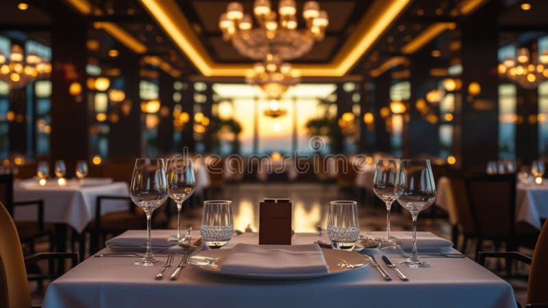

# 🍽️ Bella Vista Restaurant Website

A premium, modern, and fully responsive restaurant website built with pure HTML, CSS, and JavaScript. Designed to look like a real, professional business website ready to be sold to a restaurant owner.



## ✨ Features

### Design
- **Luxury modern design** with warm color palette (dark charcoal, cream, gold, deep red)
- **Beautiful typography** using Playfair Display, Poppins, and Cormorant Garamond
- **Glassmorphism effects** on cards and navigation
- **Smooth scrolling** and elegant page transitions
- **Full-screen hero section** with animated background
- **Mobile-first responsive** design for all screen sizes
- **Light/Dark mode** theme toggle
- **Sticky navigation bar** with scroll effects
- **Animated scroll indicators** and hover effects

### Sections (13 Total)
1. **Hero Section** - Full-screen intro with CTAs and stats
2. **About Us** - Restaurant story, chef intro, mission
3. **Why Choose Us** - 6 feature cards highlighting USPs
4. **Featured Menu** - Filterable menu with 16 dishes across 5 categories
5. **Special Offers** - 3 promotional cards with discount badges
6. **Reservation** - Form with validation and success modal
7. **Gallery** - Masonry grid with lightbox functionality
8. **Testimonials** - Auto-sliding customer reviews with controls
9. **Meet Our Chefs** - 4 chef profile cards
10. **Statistics** - Animated counters (15K+ customers, etc.)
11. **FAQ** - Accordion-style frequently asked questions
12. **Contact** - Contact info, form, and Google Maps
13. **Footer** - Newsletter, links, social, contact info

### JavaScript Features
- 📱 Mobile hamburger menu
- 🎨 Theme toggle (Light/Dark) with localStorage
- 📌 Sticky navbar with scroll detection
- 🎯 Active navigation highlighting
- ✨ Scroll reveal animations
- 🔢 Animated statistics counters
- 🍔 Menu category filtering (no reload)
- 🎠 Auto-rotating testimonial slider
- ❓ FAQ accordion
- 🖼️ Gallery lightbox with keyboard navigation
- ⬆️ Back-to-top button
- ✅ Form validation (email, phone, required fields)
- 💬 Reservation success modal/popup
- ⏳ Loading screen animation
- 👆 Touch swipe support for mobile

## 📁 Project Structure

```
bella-vista/
├── index.html          # Main HTML file
├── css/
│   ├── style.css       # Main stylesheet
│   └── responsive.css  # Responsive design
├── js/
│   ├── data.js         # Menu, gallery, testimonials data
│   └── main.js         # All interactive features
├── images/             # All food, interior, and people images
└── README.md           # This file
```

## 🚀 Getting Started

1. **Open the website** - Simply open `index.html` in any modern browser
2. **Or use a local server** for best experience:
   ```bash
   cd bella-vista
   python3 -m http.server 8000
   # Visit http://localhost:8000
   ```

## 🎨 Color Palette

| Color | Hex | Usage |
|-------|-----|-------|
| Gold | `#d4a574` | Accents, CTAs, headings |
| Cream | `#f5ebe0` | Light text, backgrounds |
| Charcoal | `#1a1a1a` | Dark backgrounds |
| Deep Red | `#8b2635` | Special accents, CTAs |

## 📱 Responsive Breakpoints

- **Desktop**: 1200px+
- **Tablet**: 768px - 1024px
- **Mobile**: Below 768px
- **Small Mobile**: Below 480px

## 🌐 Browser Support

- ✅ Chrome / Edge (latest)
- ✅ Firefox (latest)
- ✅ Safari (latest)
- ✅ Mobile browsers (iOS Safari, Chrome Android)

## ♿ Accessibility

- Semantic HTML5 elements
- ARIA labels on icon buttons
- Keyboard navigation support (Escape, Arrow keys for lightbox)
- Focus styles on all interactive elements
- Reduced motion support
- Proper form labels
- High contrast text colors

## 🔍 SEO Features

- Semantic HTML structure
- Meta description and keywords
- Open Graph tags
- Descriptive image alt attributes
- Proper heading hierarchy
- Fast loading with lazy-loaded images

## 📄 License

This is a demo restaurant website built for showcasing purposes. Feel free to use, modify, and adapt for client projects.

---

**Crafted with ❤️ for fine dining experiences.**
